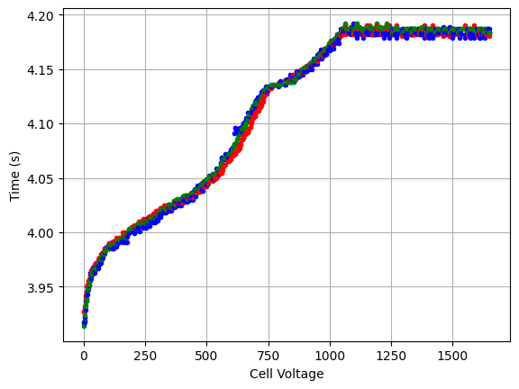
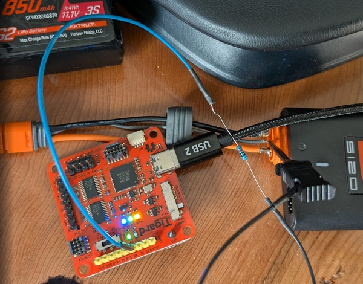
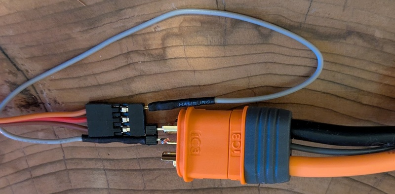

# Python BattGo / Spektrum Smart Battery Protocol Implementation

BattGO is a technology developed by [isdt](https:/www.isdt.co) to simplify LiPol battery management. This has a small "data" pin alongside power pins with "normal" RC hobby connectors that allows the charger to monitor individual cell data, as well as know what charge currents the battery should use.

BattGO was licensed by HorizonHobby / Spektrum and is now used as their Spektrum Gen2 SMART batteries, using a quasi-proprietary "IC3" connector (modified version of EC3 with another pin).

Note that BattGo products appear to work with Spektrum batteries. An existing [Go BattGO](https://github.com/BertoldVdb/go-battgo) implementation included sufficient information to implement this Python version. Presumably there was developer documentation available but the links no longer work.

The BattGO website is no longer functional, but you can find copies of pages from the wayback machine.

## Physical Interface

The protocol is a serial protocol at 9600 baud, using open-drain drivers. The protocol appears to be pulled up to the *battery voltage* on the chargers so be careful interfacing this to normal logic-level devices.

## Examples

This project is not (currently? ever?) a real python package, but some small scripts and examples.

### Sniffing with a serial cable

If you connect the data pin to a serial RX pin, then [demo_sniff.py](demo_sniff.py) will provide real-time analysis of the packets. For this demo I used a 10kOhm resistor in series with the data pin to limit current, and used a serial port with a voltage translator that "should" be fine with the 1mA input drive that results. This demo also data logs the cell voltages with a system timestamp. This lets you make graphs of your charger performance:



Here is an example of the connection:


Note that the ground connection here is provided via USB - both my USB serial and charger are plugged into a computer USB port. You would normally also need the ground connection (data & power ground are shared). You can use the balance port ground pin as an easy ground so you only have one clip on the battery lead.

The Spektrum USB Programming cable (SPMA3065) could possibly be used in this way *with a 10K-ohm series resistor*, but I haven't tested that yet. Feel free to open an issue if this could be useful.

### Reading a battery with a FTDI Cable (SPMA3065)

The Spektrum programming cable uses an FTDI chip with some sort of open-drain driver. You can see details of a homebrew design in [this rcgroups post](https://www.rcgroups.com/forums/showpost.php?p=44758101&postcount=29). This works with newer FTDI chips as well (see my post later in the thread using FT231x/FT230x).

In my testing the pull-up is *not* on the battery connector (which makes sense from a power-saving perspective), and a few batteries I tested *did* work with 3.3V I/O, despite the chargers pulling up the I/O pin to a much higher voltage. This means you can simply connect the "AS3X Programming Cable" (which is an open-drain single-wire UART connection) to the data pin of a *battery* (DO NOT connect to a charger directly as the charger will output a higher voltage):



Again - I don't know if some batteries have a pull-up, so this would be better with a diode clamp. At minimum I suggest plugging this into a USB hub so it hopefully gives you some buffer. **A slip of touching the Battery +BAT pin which is right beside the data pin will put 12V into your computer USB port at sufficient available amperage to vapourize any silicon components in the path**, this is not normally something they enjoy.

The file [demo_ftdicable.py](demo_ftdicable.py) can successfully talk to a few batteries I tried, and gets their status and cell voltages:

```
$ python demo_ftdicable.py
aa01000d008a88888888888888888888887006
01 00 1 :020000000000000000000000
REQ: Ping
aa01000d018b8b8d8f91939597999b9d9f0107
00 01 1 :0301001101ba29d2741e01
aa01000d02886c93968b9f188f78daacb7b306
RESP: Pong
01 00 1 :020000000000000000000000
REQ: Ping
01 00 1 :02e201001101ba29d2741e01
REQ: Ping
e2 01 1 :0301001101ba29d2741e01
RESP: Pong
aa01e2020303eb00
01 e2 1 :88
REQ: Factory info
aa01e2020404ed00
e2 01 1 :8901b80be40c68103c0f5203000032002c01ec3cec2d010300
{'battery type': 'LiPo', 'battery number of cells': 3, 'battery supports auto discharge': True, 'cell discharge cutoff voltage': 3.0, 'cell discharge normal voltage': 3.3, 'cell charge max voltage': 4.2, 'cell storage default voltage': 3.9, 'cell capacity (mAh)': 850.0, 'battery max charge current (A)': 4.25, 'battery max discharge current (A)': 25.5, 'low temp use (C)': -20, 'high temp use (C)': 60, 'low temp storage (C)': -20, 'high temp storage (C)': 45}
01 e2 1 :88
REQ: Factory info
e2 01 1 :8901b80be40c68103c0f5203000032002c01ec3cec2d010300
{'battery type': 'LiPo', 'battery number of cells': 3, 'battery supports auto discharge': True, 'cell discharge cutoff voltage': 3.0, 'cell discharge normal voltage': 3.3, 'cell charge max voltage': 4.2, 'cell storage default voltage': 3.9, 'cell capacity (mAh)': 850.0, 'battery max charge current (A)': 4.25, 'battery max discharge current (A)': 25.5, 'low temp use (C)': -20, 'high temp use (C)': 60, 'low temp storage (C)': -20, 'high temp storage (C)': 45}
aa01e20205cfb901
aa01e20206ccb701
01 e2 1 :42
REQ: User settings
e2 01 1 :435203003c0f541048ce40ea407640a93f01
{'user battery charge current (a)': 0.85, 'user cell storage voltage': 3.9, 'user cell max voltage': 4.18, 'user self discharge enabled': True, 'user self discharge time (h)': 72}
01 e2 1 :42
REQ: User settings
aa01e20507cb919da18903
e2 01 1 :435203003c0f541048ce40ea407640a93f01
{'user battery charge current (a)': 0.85, 'user cell storage voltage': 3.9, 'user cell max voltage': 4.18, 'user self discharge enabled': True, 'user self discharge time (h)': 72}
aa01e20508d49092907603
01 e2 1 :44000200
REQ: State
e2 01 1 :4500024c104710411014000000000000
{'cell voltages (V)': [4.172, 4.167, 4.161], 'battery temp (c)': 20}
aa01e20509d59397978703
01 e2 1 :44000200
REQ: State
e2 01 1 :4500024c104710411014000000000000
{'cell voltages (V)': [4.172, 4.167, 4.161], 'battery temp (c)': 20}
01 e2 1 :44000200
REQ: State
aa01e2050ad696a8bec403
e2 01 1 :4500024c104710411014000000000000
{'cell voltages (V)': [4.172, 4.167, 4.161], 'battery temp (c)': 20}
01 e2 1 :44000200
REQ: State
e2 01 1 :4500024c104710411014000000000000
{'cell voltages (V)': [4.172, 4.167, 4.161], 'battery temp (c)': 20}
aa01e2050bd795a9bdc503
01 e2 1 :44000200
REQ: State
aa01e2050cd0acb6ccf203
e2 01 1 :4500024c104710411014000000000000
{'cell voltages (V)': [4.172, 4.167, 4.161], 'battery temp (c)': 20}
01 e2 1 :44000200
```

### Decoding Pre-Recorded Data

If you run the file `demo.py` it will decode a few example captures. You will see both the unscrambled data along with the decoded data. There are two different captures, one from a charge starting (capturing the initial plugging in of the battery, showing the discover and address assignment) and one from later on in an in-progress storage discharge (showing a slowly decreasing battery voltage).

```
 --> Decoded: REQ: Factory info
e2 01 1 :8901b80be40c68103c0f5203000032002c01ec3cec2d0103ff
 --> Decoded: {'battery type': 'LiPo', 'battery number of cells': 3, 'battery supports auto discharge': True, 'cell discharge cutoff voltage': 3.0, 'cell discharge normal voltage': 3.3, 'cell charge max voltage': 4.2, 'cell storage default voltage': 3.9, 'cell capacity (mAh)': 850.0, 'battery max charge current (A)': 4.25, 'battery max discharge current (A)': 25.5, 'low temp use (C)': -20, 'high temp use (C)': 60, 'low temp storage (C)': -20, 'high temp storage (C)': 45}
 ```

```
 --> Decoded: REQ: State
5e 01 1 :450002c50fb70fbd0f17000000000000
 --> Decoded: {'cell voltages (V)': [4.037, 4.023, 4.029], 'battery temp (c)': 23}
 ```

## Basic Protocol Information

The serial protocol assigns an address to the battery, this happens during the initial "ping/pong" messages. The charger will be address `01`, and it will broadcast a messages to `00`. After that it will send a message with the battery address, in the example demos the battery is address `5E` or `E2` (this was with 2 different chargers). It may be randomly assigned, I haven't tried multiple times yet.

Messages are "scrambled" - a sequence number is used for the scrambling, so messages are not repeated over the wire. This may be done to improve reliability (avoid sequences of 0's repeating). Luckily this was previously discovered.

All messages start with the 0xAA header & have a checksum. If 0xAA appears in the data it is handled with byte stuffing (0xAA will appear twice in the byte stream, this is removed on processing).

The controller polls the battery for updates, here is an example of two "over the wire" messages:

```
AA 01 5E 05 91 5D 3B 5F 7F 6B 02
AA 5E 01 11 2D F0 CF D3 6D 22 CE 86 21 EA 28 41 43 5D A7 F9 0B D1 08
```

These correspond to the following

```
01 5e 1 :44000200
 --> Decoded: REQ: State
5e 01 1 :450002be0fb90fba0f17000000000000
 --> Decoded: {'cell voltages (V)': [4.03, 4.025, 4.026], 'battery temp (c)': 23}
 ```

### Available Information

This interface provides currently:

* Manufacturer Data
  - Serial Number
  - Allowed storage temp range
  - Allowed usage temp range
  - Battery technology and number of cells
  - Battery max discharge current
  - Battery max charge current
  - Battery capacity (ah)
  - Battery voltages: max, storage, discharge, and low-voltage cut-off
  - If battery supports auto discharge

* User Settings:
  - Preferred charge current
  - Preferred charge voltage
  - Preferred storage voltage
  - Self discharge timeout options

* Statistics:
  - Current cell voltages
  - Current temperature
  - Charge cycles
  - Over-charge errors stored
  - Over-discharge errors stored
  - Over-temp errors stored

The internal cell resistance which is displayed on chargers appears to be calculated from charge current & cell voltage, and thus is not available.

## Related Useful Information

I leave the following links here in case it's useful, will move to a blog post eventually.

#### go BattGO

[go BattGO](https://github.com/BertoldVdb/go-battgo)

I based this work on the BattGo project - this is just a Python port of the go code.

#### isdtool

[isdttool](https://github.com/maxried/isdttool)

This allows communication over USB (HID) with the charger - the S120 could return the voltages on the physical balance port, but I was unable to get values of the smart battery. Will push minor changes to get that working, but ultimately the lack of interface led me to instead sniff the battery protocol to be able to monitor the cell charging with the S120.

Note the isdttool project includes a FW decryption & analysis tool - I didn't need this as had no need to R.E. any firmware, but the Spektrum FW is the same as ISDT (rebadged as far as I can tell) so if needed could be useful for future work in reading out the status.

## Disclaimers

This is provided AS-IS - you may damage your batteries or charger, this is NOT an official protocol or project and based on other open-source projects. See [LICENSE](LICENSE). You are responsible for safe usage and charging of your batteries. This is NOT associated with any manufacturer or official battery provider. Any trademarks referenced belong to their associated owners, and those trademarks are used to identify the products, not to imply any affiliation, endorsement, or sponsorship of the trademark owners.